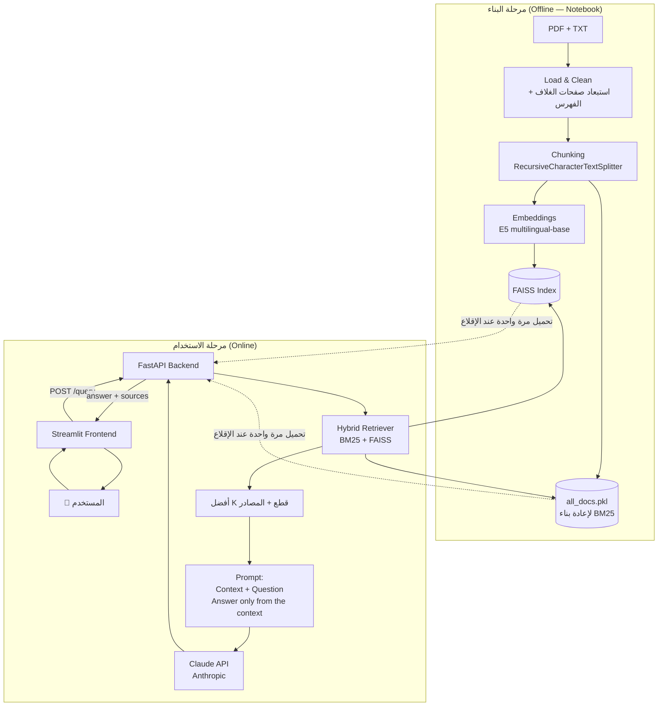

# 📖 RAG System

A complete **Retrieval-Augmented Generation (RAG)** system that answers user questions based **only** on the content of two Seerah books:

1. **Mukhtasar Al-Seerah Al-Nabawiyyah by Ibn Hisham** (`alsyra_alnubawia.pdf`)
2. **Ar-Raheeq Al-Makhtum** (`raw_text.txt`)

The project includes a notebook for building and evaluation, a FastAPI backend, a Streamlit frontend, and a ready-to-use Vector Store.

---

## 🏗️ Architecture

### Offline Phase (Notebook)
- Load and clean PDF/TXT sources
- Remove cover pages and table of contents
- Chunk documents using `RecursiveCharacterTextSplitter`
- Generate embeddings with `multilingual-e5-base`
- Build a FAISS index
- Save `all_docs.pkl` for BM25 reconstruction

### Online Phase
- User → Streamlit Frontend
- Frontend → FastAPI Backend (`POST /query`)
- Hybrid Retrieval (`BM25 + FAISS`)
- Retrieve top-K chunks and sources
- Prompt LLM with context and question
- Generate answer using Claude API
- Return answer and sources

### Core Idea
Indexing (Chunking + Embeddings + FAISS + BM25 documents) is performed **once** in the notebook and stored on disk. The backend only loads the generated artifacts at startup without rebuilding embeddings or reprocessing documents.

### Hybrid Retrieval
The retriever combines:
- **BM25** for keyword, names, and date matching.
- **FAISS/E5** for semantic similarity.

Weights: `0.45 / 0.55` through `EnsembleRetriever`.

---

## 📂 Project Structure


---

## ⚙️ Technical Decisions

| Decision | Reason |
|----------|--------|
| Chunking: `chunk_size=1200`, `overlap=200` | Preserves complete narrative context while maintaining continuity across chunks. |
| Cleaning | Removes hidden characters, diacritics, repeated headers/footers, and TOC noise. |
| Embeddings: `intfloat/multilingual-e5-base` | Strong multilingual model with good Arabic support. |
| Hybrid Retrieval | Improves retrieval quality for both exact and semantic queries. |
| Vector Store: FAISS + `all_docs.pkl` | Fast persistence and startup loading. |
| Claude API | Used only during answer generation. Includes fallback mode if API key is unavailable. |

---

## 🚀 Running the Project

### 1. Build the Vector Store

```bash
cd notebooks
pip install -r ../backend/requirements.txt jupyter
jupyter nbconvert --to notebook --execute rag_pipeline.ipynb --output rag_pipeline.ipynb
```

Generated artifacts:
- `faiss_index/`
- `all_docs.pkl`

### 2. Run the Backend

```bash
cd backend
pip install -r requirements.txt

cp .env.example .env
uvicorn app.main:app --reload --port 8000
```

Health Check:

```bash
curl http://localhost:8000/health
```

### 3. Run Tests

```bash
cd backend
pytest tests/ -v
```

### 4. Run the Frontend

```bash
cd frontend
pip install -r requirements.txt
BACKEND_URL=http://localhost:8000 streamlit run app.py
```

### 5. Docker

```bash
cd backend
docker build -t seerah-rag-backend .
docker run -p 8000:8000 --env-file .env seerah-rag-backend
```

---

## 📡 API Documentation

Swagger UI:

`http://localhost:8000/docs`

### GET /health

```json
{ "status": "ok" }
```

### POST /query

Request:

```json
{ "question": "When did the Battle of Badr occur?" }
```

Response:

```json
{
  "answer": "Generated answer based only on retrieved context...",
  "sources": ["raw_text.txt", "alsyra_alnubawia.pdf (Page 119)"]
}
```

---

## 🧪 Evaluation

See Section 5 of `notebooks/rag_pipeline.ipynb` for:
- Evaluation on 10 different questions
- Retrieved sources
- Generated answers
- Manual accuracy assessment
- Development issues and solutions

---

## ✅ Final Deliverables

- [x] Executed Notebook
- [x] Ready Vector Store
- [x] FastAPI Backend
- [x] Streamlit Frontend
- [x] Professional README with Architecture and API Documentation


## Demo link
- https://drive.google.com/drive/folders/1Pa0LZm1c4ifVL5irQSlQNkt0OXiNjMoM?usp=sharing